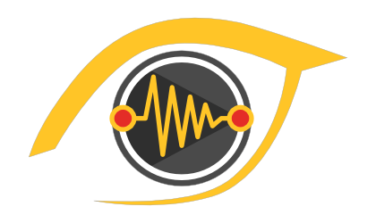
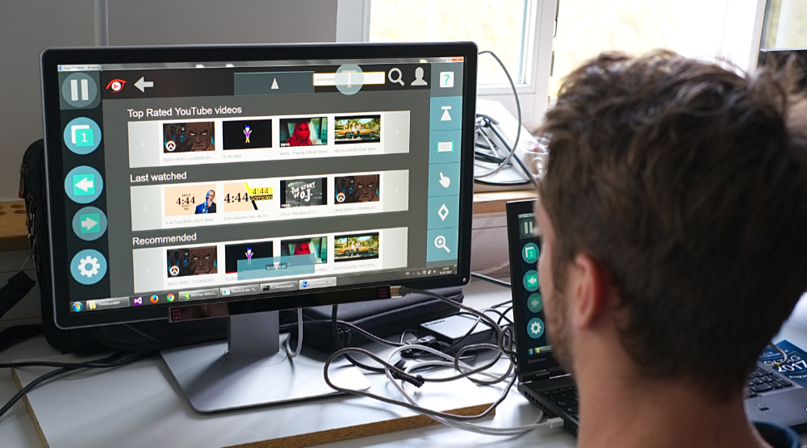

# GazeTheWeb - Watch

YouTube application controlled with gaze and processing of gaze and EEG sensor data, part of the EU-funded research project MAMEM. Developed as part of a research lab supervised by Dr. Chandan Kumar, Korok Sengupta and Raphael Menges.

## Developers
The application was designed and developed by the students who participated in the research lab:
Denise Dünnebier, Mariya Chkalova, Min Ke, Yessika Legat, Arsenii Smyrnov, Benjamin Becker, Daniyal Akbari, Matthias Greber, Ramin Hedeshy, Steven Timothy Schürstedt and Jannis Eisenmenger